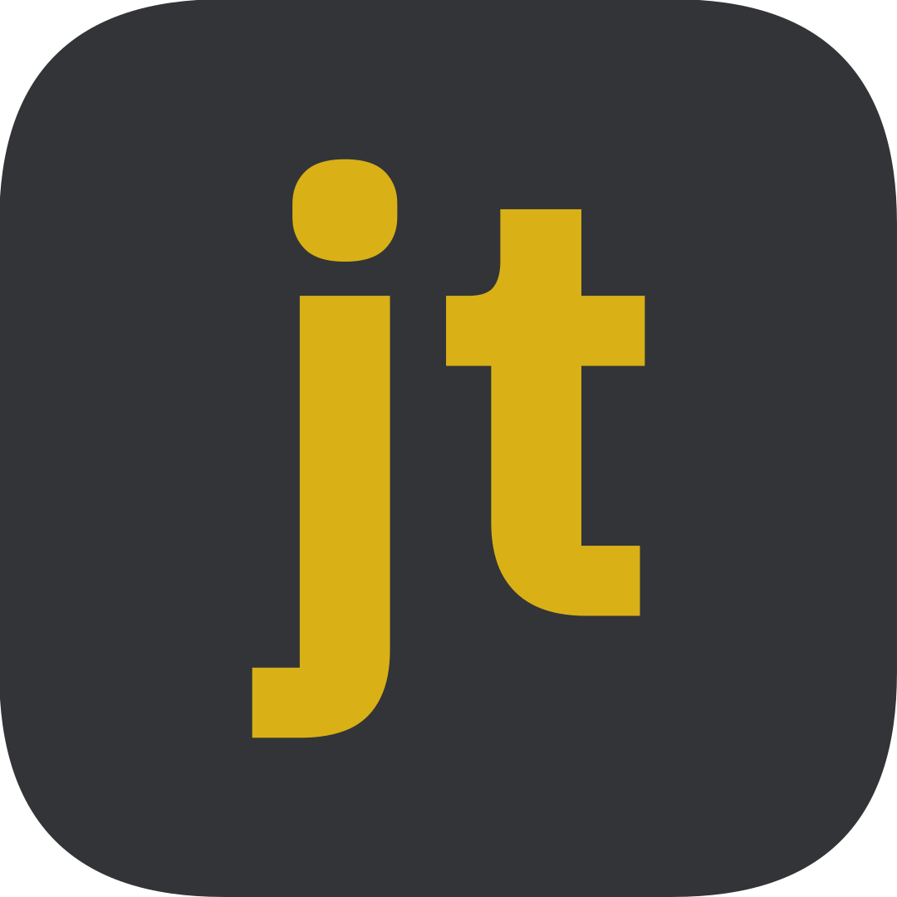

  

<h1 align="center">JustType</h1>

A customizable, open-source typing test game with just the right amount of features.

<h2 id="this-project-started-out">This project started out</h2>

as a fun way to practice eyeballing the design of a website and re-creating it myself. <em>cough</em> monkeytype <em>cough</em>.

<h2 id="but-eventually-">But eventually,</h2>

I worked for long enough that I just decided to recreate the entire website. Here we are!

<h3 id="made-in-completely-raw-javascript-css-and-html-">Made in completely <em>raw javascript, CSS, and HTML.</em></h3>

<h3 id="designed-entirely-through-eyeballing-it-never-looked-at-css-for-inspiration-">Designed entirely through eyeballing it. Never looked at CSS for inspiration!</h3>
<h3 id="no-typescript-node-js-sass-pug-web-development-toolkit-nothing-">No typescript, Node.js, SASS, Pug, web development toolkit, nothing.</h3>
